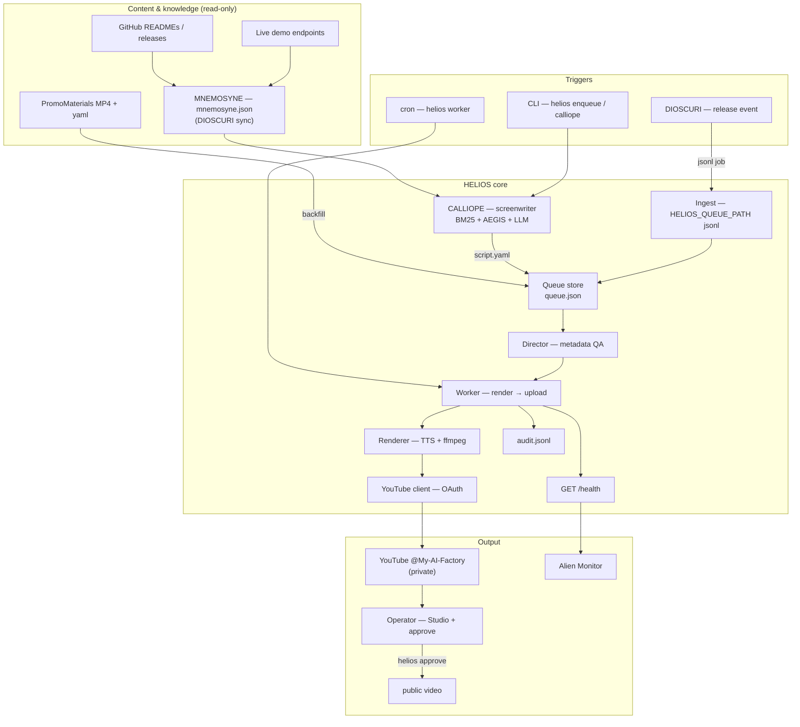

<!-- aicom-mirror-notice -->
> **📖 Read-only mirror.** `helios` is published from the canonical AI-Factory monorepo.
> **Pull requests are not accepted** — any commit pushed here is overwritten by
> `scripts/mirror_satellites.sh` on the next sync.
> 🐞 Found a bug or have a request? Please **[open an issue](https://github.com/alexar76/helios/issues)**.

# HELIOS — broadcast layer of the AIMarket ecosystem

<!-- aicom-readme-badges -->
<p align="center">
  <a href="https://github.com/alexar76/helios/actions/workflows/ci.yml"></a>
  <a href="https://github.com/alexar76/helios/actions/workflows/pages.yml"></a>
  <a href="https://alexar76.github.io/helios/"></a>
  <a href="https://www.youtube.com/@My-AI-Factory"></a>
  =3.11" />
  
  <a href="docs/badges/coverage.svg"></a>
  <a href="LICENSE"></a>
</p>
<!-- /aicom-readme-badges -->


> **Template in, voiced video out, queued to your YouTube — private until you approve.**  
> MIT · self-hosted · POST-only · no engagement bots.

🌐 **Language:** **English** · [Русский](README-ru.md) · [Español](README-es.md)

In the myth, **Helios** drives the chariot of the sun across the sky — light, rhythm, visibility.  
**HELIOS** is the broadcast satellite of the [AICOM / AIMarket ecosystem](https://magic-ai-factory.com): render ecosystem explainers, upload to [@My-AI-Factory](https://www.youtube.com/@My-AI-Factory), keep everything **private** until a human says go.

**Channel:** [@My-AI-Factory](https://www.youtube.com/@My-AI-Factory) · [playlist](https://www.youtube.com/playlist?list=PLQAJcI3MYJxM)  
**Landing:** [alexar76.github.io/helios](https://alexar76.github.io/helios/) · source: [`landing/index.html`](landing/index.html)  
**Repo:** [github.com/alexar76/helios](https://github.com/alexar76/helios)  
**Monitor:** [Alien Monitor](https://magic-ai-factory.com/monitor/) — click the **HELIOS** node for cached YouTube stats  
**Integration guide:** [helios-integration.md](https://github.com/alexar76/aicom/blob/main/docs/ecosystem/helios-integration.md)

| | |
|---|---|
| **Role** | Render MP4 → upload YouTube (private) → operator approve → public |
| **Screenwriter** | **CALLIOPE** — LLM scripts grounded in **MNEMOSYNE** (shared with DIOSCURI) |
| **Ops** | **Director** — LLM metadata review + queue priority (DeepSeek default) |

## Why HELIOS exists

The ecosystem ships constantly — releases, oracles, courses, live demos. Manual `build_series.py` + `upload_youtube.py` in PromoMaterials does not scale. **HELIOS** is the dedicated broadcast engine: one job queue, one audit trail, one human gate before anything goes public.

## Three minds (who does what)

| Entity | Myth | Job | Touches voiceover? |
|--------|------|-----|------------------|
| **CALLIOPE** | Muse of epic poetry | Pitch topics, write scripts from GitHub + demo corpus | **Yes** (new videos) |
| **Director** | Broadcast ops | Review title/description, prioritize queue | No |
| **Operator** | Human | Studio review → `helios approve` | No |

Backfill episodes (PromoMaterials S1 E10+, Season 2) use **human-authored yaml** — CALLIOPE does not rewrite them.

## Charter (non-negotiable)

1. **POST-only** — our channel only; no likes, comments, or engagement bots.
2. **Grounded creation** — CALLIOPE cites **MNEMOSYNE** (READMEs, releases, live demos); backfill stays human yaml.
3. **Private-first** — every upload starts `private`; `helios approve` for public.
4. **Human gate** — operator watches every video in YouTube Studio before approve.
5. **Fail-soft** — if HELIOS is down, Factory and DIOSCURI keep running.

## Features

| Feature | What it means |
|---------|---------------|
| Job queue | Idempotent jobs, daily upload cap (~9/day), crash-safe worker lock |
| Renderer | TTS (`say` on macOS, edge-tts on Linux) + ffmpeg + burned-in captions + SRT |
| YouTube API | Resumable upload, captions, playlist routing |
| Backfill | Upload existing PromoMaterials renders without re-encoding |
| **CALLIOPE** | `helios calliope pitch/write/enqueue` — MNEMOSYNE-grounded scripts |
| Director | LLM metadata review (DeepSeek default) |
| DIOSCURI hook | Release events → shared `HELIOS_QUEUE_PATH` jsonl |
| Alien Monitor | `GET /health` — cached YouTube stats for the graph node |
| Audit | Append-only `data/audit.jsonl` for every state transition |

## Architecture



**Job phases:** `backfill` (PromoMaterials backlog) → `creator` (CALLIOPE) → `steady` (release-shorts).

**Status flow:** `pending` → `rendering` → `uploading` → `awaiting_approval` → `published`

## Quick start (pip)

```bash
cd helios
pip install -e ".[dev]"
cp helios.config.example.yaml helios.config.yaml
cp .env.example .env
# Required: YOUTUBE_CLIENT_SECRET, YOUTUBE_TOKEN, DEEPSEEK_API_KEY
# CALLIOPE: DIOSCURI_DATA_DIR=/path/to/dioscuri/data  (reads mnemosyne.json)

helios auth
helios calliope stats          # MNEMOSYNE loaded?
helios calliope editorial-status  # weekly quota + scout cadence
helios calliope pitch          # topic ideas (manual)
helios worker                  # also runs editorial scout when due
helios approve job_...
```

### Backfill (existing renders)

```bash
helios backfill-scan
helios backfill-enqueue -n 10   # queue only; upload when quota allows
helios worker --max-jobs 4      # conservative if YouTube quota is tight
```

## Quick start (Docker)

```bash
cp helios.config.example.yaml helios.config.yaml
cp .env.example .env
docker compose up -d --build
# REQUIRED: `compose up` only runs `helios serve` — schedule the worker:
(crontab -l 2>/dev/null; echo "0 * * * * docker exec helios helios worker >> /var/log/helios-worker.log 2>&1") | crontab -
docker exec helios helios worker --max-jobs 1
```

Container: non-root, read-only rootfs, `cap_drop: ALL`, health on `:8791/health`.  
See [docs/setup.md](docs/setup.md) § Worker cron.

## Configuration

Secrets in `.env`; tuning in `helios.config.yaml` (never commit real values).

| Variable | Purpose |
|----------|---------|
| `YOUTUBE_CLIENT_SECRET` | OAuth client JSON path |
| `YOUTUBE_TOKEN` | OAuth token JSON path |
| `HELIOS_LLM_PROVIDER` | `deepseek` (default) · `anthropic` · `openai-compatible` |
| `DEEPSEEK_API_KEY` | LLM for Director + CALLIOPE |
| `DIOSCURI_DATA_DIR` | Path to DIOSCURI data → reads `mnemosyne.json` |
| `HELIOS_MNEMOSYNE_PATH` | Override MNEMOSYNE file path |
| `HELIOS_QUEUE_PATH` | Shared jsonl ingest (DIOSCURI syndication) |
| `HELIOS_DATA_DIR` | Queue, audit, scripts, renders |
| `HELIOS_DRY_RUN` | `1` = no YouTube upload |

| `helios.config.yaml` key | Default | Purpose |
|----------------------------|---------|---------|
| `limits.max_uploads_per_day` | `9` | YouTube quota margin |
| `calliope.enabled` | `true` | CALLIOPE screenwriter |
| `calliope.editorial_enabled` | `true` | Auto-scout on worker cron |
| `calliope.scout_interval_days` | `3` | Days between scout runs |
| `calliope.weekly_enqueue_quota` | `3` | Max new scripts/week |
| `calliope.backfill_pause_threshold` | `8` | Pause editorial while backfill > N |
| `director.enabled` | `true` | Metadata review before upload |

## Ecosystem position

```
aicom           → builds products
dioscuri        → community Q&A + MNEMOSYNE + release → HELIOS queue
PromoMaterials  → human episode scripts & rendered MP4 (backfill)
helios          → render + YouTube delivery  ← you are here
alien-monitor   → 3D graph + HELIOS / DIOSCURI live stats
```

## Documentation

| Doc | Description |
|-----|-------------|
| [landing/index.html](landing/index.html) | Source for [alexar76.github.io/helios](https://alexar76.github.io/helios/) — video gallery |
| [docs/setup.md](docs/setup.md) | Install, OAuth, Docker |
| [docs/usage.md](docs/usage.md) | CLI — CALLIOPE, Director, worker |
| [docs/architecture.md](docs/architecture.md) | Components, data model |
| [docs/security.md](docs/security.md) | Threat model |
| [docs/runbook.md](docs/runbook.md) | Operator playbook |

## Development

```bash
pip install -e ".[dev]"
PYTHONPATH=. pytest tests/ -q
bash scripts/ci_coverage_badge.sh   # refresh docs/badges/coverage.svg
```

CI: [`.github/workflows/ci.yml`](.github/workflows/ci.yml) (pytest + coverage badge + Docker) · Pages: [`.github/workflows/pages.yml`](.github/workflows/pages.yml) → [alexar76.github.io/helios](https://alexar76.github.io/helios/)

## License

MIT — see [LICENSE](LICENSE).
